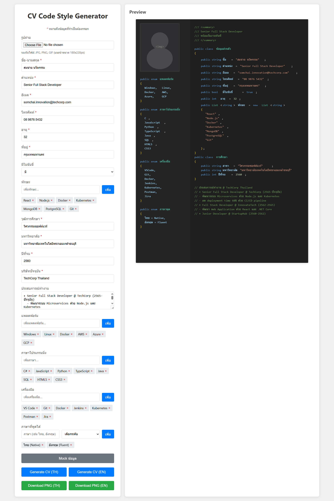

# CV Code Style Generator

เครื่องมือสร้าง CV ในรูปแบบ Code Editor Theme สำหรับนักพัฒนาซอฟต์แวร์


## 📸 ตัวอย่างหน้าตา



## 🎯 Features

- **Code Editor Theme**: แสดง CV ในรูปแบบโค้ด IDE Theme (VS Code Dark Theme)
- **Bilingual Support**: รองรับการสร้าง CV ทั้งภาษาไทยและอังกฤษ
- **Photo Upload**: อัพโหลดรูปถ่ายได้ (รองรับ JPG, PNG, GIF)
- **Export to PNG**: ดาวน์โหลด CV เป็นไฟล์รูปภาพ PNG
- **Mock Data**: มีข้อมูลตัวอย่างสำหรับทดสอบ
- **Real-time Preview**: ดูตัวอย่าง CV แบบ Real-time
- **Responsive Design**: รองรับการใช้งานบนอุปกรณ์ต่างๆ

## 🚀 การใช้งาน

1. เปิดไฟล์ `index_simple.html` ในเว็บเบราว์เซอร์
2. กรอกข้อมูลในแบบฟอร์มทางด้านซ้าย:
   - ข้อมูลส่วนตัว (ชื่อ, ตำแหน่ง, อีเมล, โทรศัพท์, ฯลฯ)
   - การศึกษา (วุฒิการศึกษา, มหาวิทยาลัย, ปีที่จบ)
   - ทักษะต่างๆ (Skills, Platforms, Languages, Tools)
   - ประสบการณ์ทำงาน
   - ภาษาที่พูดได้
3. คลิก "Generate CV (TH)" หรือ "Generate CV (EN)" เพื่อสร้าง CV
4. คลิก "Download PNG (TH)" หรือ "Download PNG (EN)" เพื่อดาวน์โหลด

## 🎨 โครงสร้างไฟล์

```
CVCodeStyleGenerator/
├── index_simple.html    # ไฟล์หลักที่รวม HTML, CSS, และ JavaScript
├── styles.css          # ไฟล์ CSS สำหรับการจัดรูปแบบ
└── README.md          # ไฟล์คู่มือนี้
```

## 💻 รูปแบบการแสดงผล

CV จะแสดงผลในรูปแบบโค้ด C# ที่ประกอบด้วย:

- **Class PersonalInfo**: ข้อมูลส่วนตัว
- **Class Education**: ข้อมูลการศึกษา
- **Enum Platform**: แพลตฟอร์มที่ใช้งานได้
- **Enum Languages**: ภาษาโปรแกรมมิ่งที่ใช้
- **Enum Tools**: เครื่องมือที่ใช้งาน
- **Enum SpokenLanguages**: ภาษาที่พูดได้
- **Comments**: ประสบการณ์ทำงานในรูปแบบ comment

## 🛠️ เทคโนโลยีที่ใช้

- **HTML5**: โครงสร้างหน้าเว็บ
- **CSS3**: การจัดรูปแบบและตกแต่ง
- **JavaScript (Vanilla)**: ตรรกะการทำงานและการสร้าง SVG
- **SVG**: การสร้างและแสดงผล CV
- **Canvas API**: การแปลง SVG เป็น PNG

## 📝 ข้อมูลที่จำเป็นต้องกรอก

- ชื่อ-นามสกุล
- ตำแหน่ง
- อีเมล
- โทรศัพท์
- อายุ
- ที่อยู่
- วุฒิการศึกษา
- มหาวิทยาลัย
- ปีที่จบ
- บริษัทปัจจุบัน

## 🌐 การรองรับภาษา

ระบบรองรับการแปลงคำศัพท์ระหว่างภาษาไทยและอังกฤษ เช่น:
- ข้อมูลส่วนตัว ↔ PersonalInfo
- การศึกษา ↔ Education
- ทักษะ ↔ Skills
- ประสบการณ์ทำงาน ↔ Work Experience

## 📱 Responsive Design

- Desktop: แสดง Form และ Preview แบบเคียงข้างกัน
- Mobile/Tablet: แสดง Form และ Preview แบบบนล่าง

## 📄 License

โปรเจคนี้เผยแพร่ภายใต้ MIT License

## 👨‍💻 Developer

สร้างโดยนักพัฒนาที่รักการเขียนโค้ดและต้องการ CV ที่แตกต่าง 🚀

---

**หมายเหตุ**: โปรเจคนี้สร้างขึ้นเพื่อเป็นตัวอย่างและแรงบันดาลใจในการสร้าง CV ที่มีเอกลักษณ์สำหรับนักพัฒนาซอฟต์แวร์